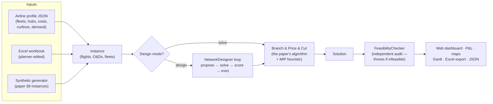
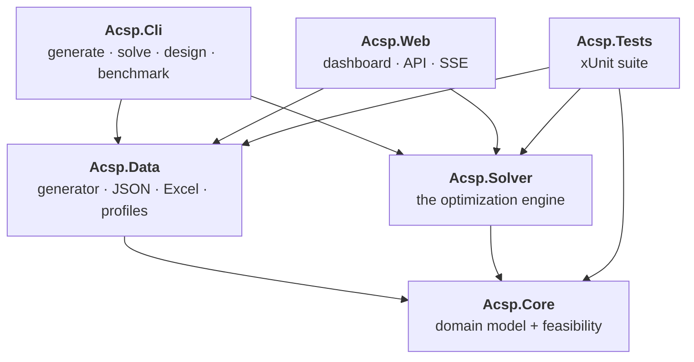
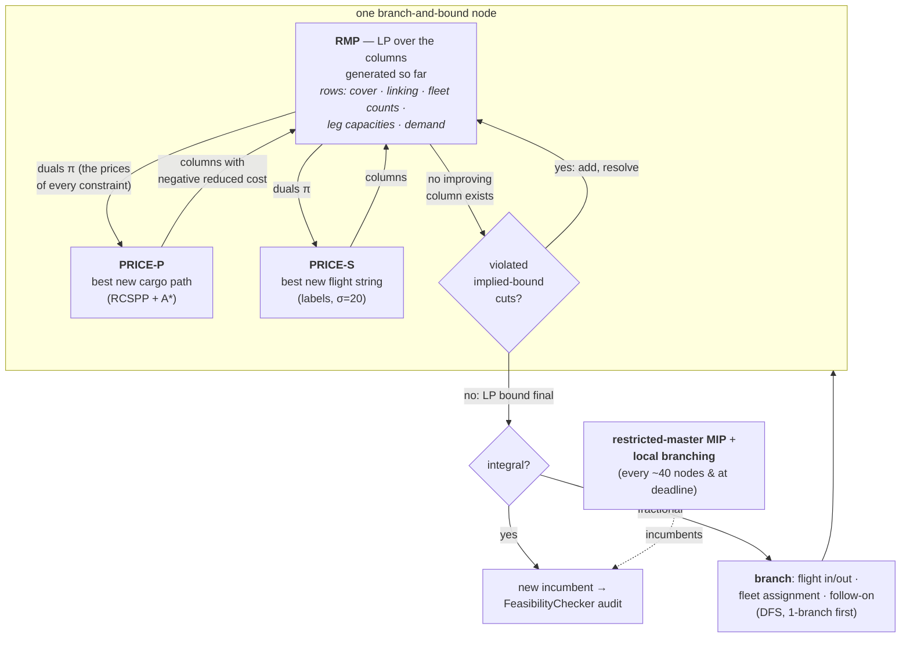
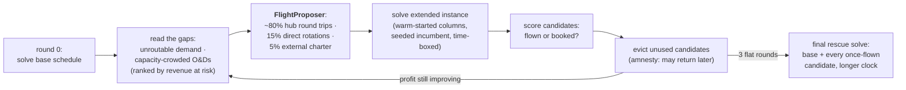

# ACSP — Integrated Air Cargo Network Optimization

**An optimizer that designs a cargo airline's weekly network end-to-end: which flights to fly, which aircraft type flies each one, how the physical fleet rotates through them (maintenance included), and which shipments travel on which itineraries — all decided *together*, in one mathematical model.**

Measured on industry-scale synthetic instances, letting the tool design the network autonomously lifts weekly operating profit by **+240%** (regional carrier), **+67%** (mid-size international), and **+110%** on an integrator-scale network with 1,250+ weekly flights and 9,000+ origin–destination demands.

> 🧪 **All data is fictional.** Every airline in this repository is synthetic: the four archetypes from the paper (RC, IC, MI, EX) plus two added here — **GI** ("Global Integrator") and **RLA** ("Real-Life-scale Airline"). All costs, demand volumes, aircraft fleets, and hub choices are **plausibility estimates produced by Claude (Anthropic's AI assistant)**, calibrated in scale to the paper's published Tables 1–2. Nothing in this repository is data from, or a claim about, any real company.

> 📐 **New here?** Read [the interactive algorithm explainer](docs/branch-and-price.html) *(open locally in a browser, or via GitHub Pages)* for a visual walkthrough of branch-and-price: the master problem, pricing, constraints, cuts, and how they compose into the full system. The deep technical report is [ALGORITHM.md](ALGORITHM.md).

---

## 1. The business problem

A cargo airline sells one product: *a tonne of freight, picked up here, delivered there, by a deadline.* Behind that promise sit four planning decisions that are traditionally made by **different teams, in sequence, each treating the previous team's output as fixed**:

| Decision | Question | Classic silo |
|---|---|---|
| **Flight selection** | Which flights should exist in next season's schedule? | Network planning |
| **Fleet assignment** | Which aircraft type (777F? A330F? 737F?) operates each flight? | Fleet planning |
| **Rotation planning** | Can the *physical* aircraft actually chain those flights — including returning to base for A-check maintenance? | Ops / crew scheduling |
| **Cargo routing** | Which shipments do we accept, and over which itineraries (direct? via hub? two hubs?) do they travel? | Revenue management |

The silo pipeline leaks money at every hand-off, because the four decisions are **coupled**:

- A new flight is only profitable if the *right* aircraft flies it, a rotation can actually get that aircraft there, and there is connecting cargo to fill it. Evaluate the flight in isolation and you'll reject flights that would have paid for themselves — or add flights that never fill.
- Cargo doesn't fly point-to-point: a single Nairobi→Chicago shipment might ride a feeder to the Middle East hub, a trunk flight to Europe, and a distribution flight onward. Whether the *feeder* is worth flying depends on the *trunk's* spare capacity three time zones away.
- Aircraft are the scarcest asset. One tail flying an unprofitable rotation is a tail unavailable for a profitable one.

**This tool makes all four decisions in a single integrated optimization**, over a periodic week (10,080 minutes that wrap around), with real-world operational constraints: payload–range curves (a 777F lifts fewer tonnes on a 12,000 km leg than a 3,000 km one), night curfews at non-hub airports, cargo handling times, transfer times at hubs, delivery deadlines, maintenance checks, and per-fleet aircraft counts.

### What you can ask it

- *"Here is my current schedule and a list of 300 candidate flights — which ones should I add, and what happens to my P&L?"* → one integrated solve.
- *"Design my network for me."* → the **autonomous design loop** invents candidate flights aimed at unserved demand, solves, keeps what pays, evicts what doesn't, and repeats until profit flattens — no human in the loop.
- *"Which demand am I leaving on the ground, and what revenue is at risk?"* → demand-at-risk report in the web dashboard.
- *"What if I must deliver **everything** (a service commitment), outsourcing what I can't fly myself?"* → deliver-all mode minimizes the contracting bill instead of maximizing cherry-picked profit.
- *"The network is planet-scale — optimize it region by region."* → **regional split**: freeze the world, re-optimize one hub region at a time (optionally cross-region *pairs*), merge only when the globally verified profit improves. Measured: +4–5M in minutes where the whole-network solver stalled at +0 for 90.
- *"My planner wants to hand-edit the schedule in Excel."* → full round-trip: export the instance to a workbook, edit, re-upload, re-optimize.

### Product surface

- **Web dashboard** (`http://localhost:5170`): world map of the designed network (own flights by load, contracted lanes in amber), time-space diagram, rotation Gantt per aircraft, live solver convergence, O&D demand-at-risk report, P&L breakdown, design-round progress, Excel export. "Regional split" and "+pairs" are toolbar switches for both Solve and Design.
- **CLI**: `generate` / `solve` / `design` (`--regional`, `--regional-pairs`) / `regional-bench` (A/B: whole-network vs split) / `benchmark` / `profile` / `template` / `diag`.
- **Airline profiles**: any airline archetype exports to an editable JSON (hubs, fleets, costs, payload-range curves, curfews, demand model) and back.

---

## 2. The science

The optimization core is a faithful implementation of:

> Ulrich Derigs, Stefan Friederichs — **"Air cargo scheduling: integrated models and solution procedures"**, *OR Spectrum* (2013) 35:325–362. DOI [10.1007/s00291-012-0299-y](https://doi.org/10.1007/s00291-012-0299-y)

The paper's model **ACSP-T** is a *path-flow formulation*: instead of deciding leg-by-leg, the variables are entire **cargo itineraries** ("paths") and entire **aircraft work-weeks** ("flight strings"). There are astronomically many of both, so the model is solved by **branch-and-price-and-cut** — column generation inside a branch-and-bound tree, with problem-specific cutting planes. Without maintenance constraints the procedure is *exact* (proves optimality); with maintenance it is approximate in exactly the way the paper's is (§9).

**This repository goes beyond the paper** in ways that turned a research algorithm into a usable network-design tool:

| Addition | What it buys | Where |
|---|---|---|
| Restricted-master **MIP heuristic** (price-and-branch) | First feasible schedule in minutes instead of never on 1,250-flight instances | `BranchAndPrice` |
| **Local-branching** adoption (Fischetti–Lodi) | Tractable "best ≤ k changes" improvement steps on 29,000-O&D models | `BranchAndPrice` |
| **Autonomous design loop** | Invents, tests, and evicts candidate flights — designs the network with no human input | `NetworkDesigner`, `FlightProposer` |
| **Deliver-all mode** with contracted recourse | Models service commitments; every intermediate solution is completable | `ExternalRecourse` |
| **O&D consolidation** (screening model) | Coarsens 29k demands into hub-to-hub pseudo-demands for design; final solve is always exact on the original | `OdConsolidator` |
| **Regional fix-and-optimize** | Planet-scale instances: re-optimize one continent at a time against a frozen backbone | `RegionalOptimizer` |
| **Payload-range curves, curfews, handling times** | Operational realism, entering the LP *exactly and linearly* | `Acsp.Core` + pricers |
| Dual **LP backends** | HiGHS (open source) and IBM CPLEX (1.5–3.4× faster, auto-detected) behind one interface | `Lp/` |
| Corrected **Farley dual bound** | Mathematically valid gap reporting under hard time budgets | `ColumnGeneration` |
| Independent **feasibility checker** | Every incumbent re-verified against every constraint; solver throws rather than emit an infeasible schedule | `FeasibilityChecker` |

Full detail, including measured effects and one honest negative result (hub waves), in [ALGORITHM.md](ALGORITHM.md).

---

## 3. How it works — the 60-second tour



1. **An instance** describes the airline: airports (with curfews and transfer times), fleets (counts, capacities, payload-range curves, costs), mandatory + optional flights, and O&D demand (tonnes, volume, availability, deadline, rate).
2. **One integrated solve** decides everything at once via branch-and-price-and-cut (§4 below).
3. In **design mode**, an outer loop wraps the solver: propose candidate flights aimed at demand the last solution left on the ground → re-solve → keep flights that fly, evict ones that don't → repeat until profit flattens.
4. Every accepted solution passes an **independent feasibility audit** before you ever see it.

---

## 4. Architecture

### 4.1 Projects



| Project | Role |
|---|---|
| [`src/Acsp.Core`](src/Acsp.Core) | The **domain**: periodic time arithmetic, airports/fleets/legs/flights/O&Ds, path & string feasibility rules, `Solution`, and the independent `FeasibilityChecker`. No solver code — pure business rules. |
| [`src/Acsp.Data`](src/Acsp.Data) | **Instances in and out**: the synthetic generator calibrated to the paper's Tables 1–2 (airlines RC/IC/MI/EX × sets I/II/III), airline profile JSONs, JSON solution IO, and the Excel round-trip (raw OpenXML, no external libraries). |
| [`src/Acsp.Solver`](src/Acsp.Solver) | The **engine** — every component described in §4.2. |
| [`src/Acsp.Cli`](src/Acsp.Cli) | Command-line front end: `generate`, `solve`, `design`, `benchmark`, `template`, `diag`. |
| [`src/Acsp.Web`](src/Acsp.Web) | Local web app: REST API + server-sent events driving the live dashboard. |
| [`tests/Acsp.Tests`](tests/Acsp.Tests) | Verification suite — pricers vs brute force, column generation vs pre-generated LPs, B&P&C vs direct MIP, Farley bound forensics, feasibility invariants (§6). |

### 4.2 Inside the solver

Every component, in the order data flows through them:

**`TimelineNetwork`** — builds the time-space graph (paper §3.2): one node per (airport, event time) in the periodic week, ground arcs that *wrap around* Sunday→Monday, and flight arcs. Both pricers search this graph. Periodicity is the subtle part: a rotation or an itinerary may cross the week boundary, and the network makes that seamless.

**`Rmp`** — the *Restricted Master Problem*, the LP at the heart of column generation. Holds the paper's rows (14)–(22): mandatory-flight cover, optional-flight selection linking, string–flight linking, per-fleet aircraft counts, per-(leg, fleet) **weight and volume capacities** (this is where the payload-range curve enters, as the exact linear capacity coefficient), and per-O&D demand limits (equalities in deliver-all mode). Also owns the **implied-bound cut pool** (§8 of the paper): cuts that tie cargo flow on a leg to the *selection* variable of the flight operating it, closing the gap where fractional flight selection lets capacity leak.

**`PathPricer`** — PRICE-P (paper §6.1). Given the LP duals, finds the cargo itinerary with the most negative reduced cost per O&D: a resource-constrained shortest path (deadline, transfer count) solved with **A\*** using an admissible lower-bound heuristic and dominance tests. Also enforces cargo handling times and curfew-shifted timings.

**`StringPricer`** — PRICE-S (paper §6.2). Prices entire aircraft work-weeks: sequences of flights one tail can fly, with turn times, and an A-check maintenance visit within the required interval. Searches a multi-week DAG with resource labels, label limit σ = 20, and the paper's *bucket ordering*. Exact when maintenance is off (making the whole algorithm exact); approximate with it — same trade as the paper.

**`PricingRestrictions`** — the bridge between branching and pricing: visibility flags (this leg is branched out, this flight must be flown by fleet k, string covering flight *i* must continue to flight *j*) that reshape the pricing graphs at each branch-and-bound node so pricers can never regenerate a branched-away column.

**`ColumnGeneration` + `MasterDuals`** — the loop: solve RMP → extract duals → run both pricers → add negative-reduced-cost columns → repeat until none exist. Under a hard time budget it returns a **Farley dual bound** — a mathematically valid bound computed from the best missing-column reduced costs (with the membership subtlety documented in ALGORITHM.md §5.2) — so reported gaps are honest even when cut short.

**`Branching` + `BranchAndPrice`** — the tree (paper §7, Fig. 3): problem-specific branching on optional-flight selection (in/out), fleet assignment, and follow-on decisions; depth-first, 1-branch first. `BranchAndPrice` orchestrates nodes, cuts, and the two primal heuristics: the **restricted-master MIP** (re-solve all generated columns as an integer program every ~40 nodes and at the deadline) and **local branching** (search within ≤ k selection flips of the incumbent — the move that produced the first-ever heuristic improvement on the 29,819-O&D RLA instance).

**`CoverConstructor`** — constructive initial incumbent for the no-maintenance model: assigns every mandatory flight a compatible fleet with per-hub arrival/departure balance. A real (if unprofitable) schedule from second zero — and a constructive feasibility proof.

**`SolutionAssembler` + `FeasibilityChecker`** — turns the integer solution into rotations, itineraries, and a P&L; then the checker (which lives in `Acsp.Core`, deliberately *outside* the solver) re-validates every constraint independently. The solver throws rather than emit an infeasible schedule.

**`DirectMipSolver`** — the baseline: the same model with pre-generated columns handed straight to the MIP solver. Exists to *verify* the sophisticated method against ground truth on small instances.

**`FlightProposer` + `NetworkDesigner`** — the autonomous design layer (§5).

**`OdConsolidator`** — screening-model coarsening: thousands of tiny, far O&Ds (2 t parcels crossing continents) consolidate into hub-to-hub pseudo-demands for the design rounds; the final solve always runs on the original demand, so delivered numbers are exact.

**`RegionalOptimizer`** — geographic fix-and-optimize for planet-scale instances: freeze everything outside one region (including intercontinental backbone flights), re-optimize the region's flights/flows/fleet slice with *exact* connection windows read from the frozen timetable, splice back, rotate regions.

**`Lp/`** — `ILpSolver` P/Invoke wrappers over **HiGHS** and **IBM CPLEX**, both passing the same dual-convention contract tests. CPLEX auto-detected and 1.5–3.4× faster on the GI set; `ACSP_LP_BACKEND=highs|cplex` overrides.

### 4.3 The optimization core, as a picture

Why columns at all? Because the natural decision variables are astronomically many: every feasible cargo itinerary and every feasible aircraft work-week. Column generation only ever *materializes the ones worth considering* — the pricers act as oracles that answer "is there any itinerary/work-week that would improve the current plan?"



For a proper visual walkthrough of each box — with worked examples of reduced costs, what a dual price *means*, why cuts are needed, and how branching interacts with pricing — open **[docs/branch-and-price.html](docs/branch-and-price.html)**.

---

## 5. The autonomous design loop

The paper assumes a human planner writes the optional-flight candidate list. This repo automates the planner:



Key engineering that makes rounds cheap and monotone: **column-pool warm starts** (round *r* re-uses round *r−1*'s columns, so pricing only works on the incremental batch), **seeded incumbents** (a round can never return less than the previous one), and **eviction** (the active model stays bounded at ~300–3,000 flights while the explored pool grows unbounded). After the final solve, the optional **regional split** polishes the schedule geographically: one hub region re-optimized at a time against a frozen world, with exact gateway windows and a monotone merge guard (ALGORITHM.md §3.5). Batch-size economics, deliver-all mode, local-branching adoption, and the measured round-by-round numbers are in [ALGORITHM.md](ALGORITHM.md) §3.

---

## 6. Verification

The exotic machinery is only trustworthy because every layer is checked against a dumber, unarguable reference:

- **Pricers vs brute force** — PRICE-P and PRICE-S (exact mode) reproduce exhaustive enumeration's best reduced cost on small instances with randomized duals and cuts.
- **Column generation vs full LP** — the colgen LP optimum matches the LP with *all* columns pre-generated, for cargo routing alone, fleet/rotation alone, and the integrated model.
- **B&P&C vs direct MIP** — the full algorithm reaches the optimum of the pre-generated-column MIP on hand-built and generated instances, with and without maintenance.
- **Farley bound forensics** — tests recompute every priced column's reduced cost from raw RMP coefficients and assert the bound's membership logic.
- **`FeasibilityChecker`** — independent re-validation of *every* constraint on *every* accepted incumbent, in a module with no solver dependencies. The solver throws rather than deliver an infeasible schedule.

Run it all with `dotnet test`.

---

## 7. Getting started

**Requirements**

- .NET 8 SDK
- HiGHS: `brew install highs` (loaded via P/Invoke; path override: `ACSP_LIBHIGHS`)
- Optional: IBM CPLEX Studio ≥ 22.1.1 — auto-detected under `CPLEX_Studio*` in `~/Applications`, `/Applications`, `/opt/ibm/ILOG` (override: `ACSP_LIBCPLEX`). Used automatically when present; force with `ACSP_LP_BACKEND=highs|cplex`.

**Run**

```bash
# tests
dotnet test

# generate the paper's 60 instances (4 airlines × 3 sets × 5 seeds)
dotnet run --project src/Acsp.Cli -c Release -- generate --airline all --set all --seeds 5

# one integrated solve (add --maintenance for A-check constraints)
dotnet run --project src/Acsp.Cli -c Release -- solve instances/RC-I-s1.json --time-limit 600

# let it design the network autonomously (add --regional for the geographic polish)
dotnet run --project src/Acsp.Cli -c Release -- design instances/RC-I-s1.json

# A/B: whole-network continuation vs regional split, same base incumbent and budget
dotnet run --project src/Acsp.Cli -c Release -- regional-bench instances/RLA-I-s1.json \
  --base-time 300 --arm-time 900 --block-time 300

# Table-3-style benchmark
dotnet run --project src/Acsp.Cli -c Release -- benchmark --airlines RC,IC,MI,EX --sets 1,2,3 \
  --seeds 1 --time-limit 600 --out results

# web dashboard at http://localhost:5170
dotnet run --project src/Acsp.Web
```

---

## 8. Measured results

Autonomous design, batch 100, 6 rounds (details and scaling experiments in [ALGORITHM.md](ALGORITHM.md) §5):

| Instance | Base profit | Designed profit | Own flights/week | Candidates accepted / tried |
|---|---|---|---|---|
| RC-I (regional) | $0.47M | **$1.60M (+240%)** | 82 → 135 | 58 / 297 |
| MI-I (mid-size) | $1.51M | **$2.53M (+67%)** | 73 → 116 | 43 / 600 |
| GI-I (integrator scale) | $44.8M | **$94.0M (+110%)** | 1,057 → 1,294 | 258 / 600 |

On GI-I the designed network operates ~1,300 own flights with 111 of 148 aircraft, serves 73.4% of 35,153 t of weekly demand, and books 21 external charters ($0.47M) for demand no own-fleet candidate can reach. Backend comparison (same instance, same limits): CPLEX solves 1.5–3.4× faster than HiGHS across the GI set; at GI-III scale both are pricing-bound, not LP-bound.

Full benchmark output lands in `results/RESULTS.md` when you run the benchmark locally (generated instances and results are not committed). All figures above are for the fictional airlines described in the data note at the top — synthetic demand, AI-estimated costs and fleets.

---

## 9. Honest limitations

- The design loop is **greedy across rounds** — inner solves carry exact bounds, but no global optimality claim spans rounds.
- With maintenance constraints the string pricer's label limit makes the procedure approximate (identical trade-off to the paper's §9).
- Instances are **synthetic and entirely fictional** — costs, demands, fleets, and hubs are AI-estimated (calibrated in scale to the paper's Tables 1–2), not real airline data; absolute dollar figures are not comparable to the paper's Table 3.
- GI-III-scale root column generation is pricing-bound; a faster LP backend doesn't help. Pricing parallelization is the obvious next lever.

---

## 10. Repository map

```
├── README.md                ← you are here
├── ALGORITHM.md             ← full technical report (the paper's core + every addition, measured)
├── docs/
│   └── branch-and-price.html← interactive visual explainer of the algorithm
├── derigs2012.pdf           ← the paper
├── src/
│   ├── Acsp.Core/           ← domain model + independent FeasibilityChecker
│   ├── Acsp.Data/           ← generator, profiles, JSON, Excel round-trip
│   ├── Acsp.Solver/         ← RMP, pricers, cuts, branching, design loop, regional split, LP backends
│   ├── Acsp.Cli/            ← command-line interface
│   └── Acsp.Web/            ← dashboard (map, Gantt, P&L, live convergence)
├── tests/Acsp.Tests/        ← verification suite
├── profiles/                ← airline profile JSONs (e.g. RLA)
├── instances/               ← generated instances (local, not committed)
└── results/                 ← benchmark outputs (local, not committed)
```
